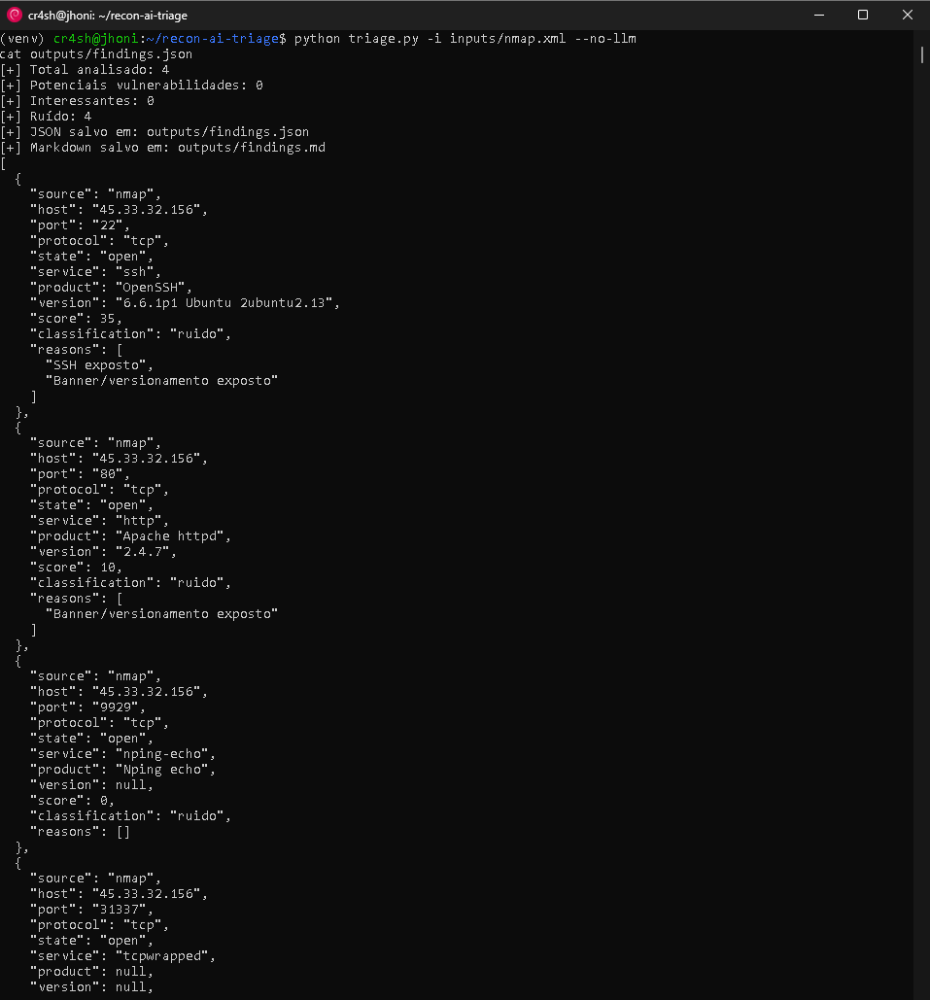

<p align="center">
  
  
  
  
</p>


# Recon AI Triage

Recon AI Triage is a Python tool designed to help Bug Bounty hunters and offensive security researchers reduce recon noise.

It analyzes outputs from tools like Nmap, FFUF and generic logs, then classifies findings as:

- Noise
- Interesting
- Potential Vulnerability

## Features

- Nmap XML analysis
- FFUF JSON analysis
- Generic log parsing
- Local scoring engine
- Optional LLM-assisted analysis
- JSON and Markdown reports

## Installation

```bash
git clone https://github.com/jonataMenezes/recon-ai-triage.git
cd recon-ai-triage
python3 -m venv venv
source venv/bin/activate
pip install -r requirements.txt
````

## Basic Usage

```bash
mkdir -p inputs outputs
nmap -sV -Pn -oX inputs/nmap.xml scanme.nmap.org
python triage.py -i inputs/nmap.xml --no-llm
```

## Output

```bash
cat outputs/findings.md
cat outputs/findings.json
```



## Security Notice

This project is intended only for authorized security testing, Bug Bounty programs and internal assessments.

Do not scan targets without permission.

## Author

Created by [@jonataMenezes](https://github.com/jonataMenezes)


